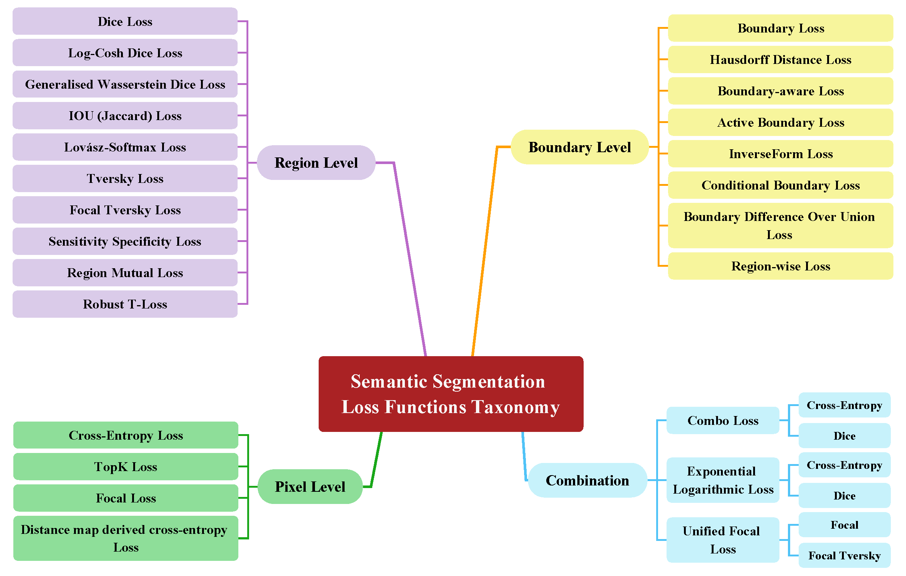

[](https://GitHub.com/Naereen/StrapDown.js/graphs/commit-activity)
[](http://makeapullrequest.com)
[](https://github.com/sindresorhus/awesome)

# LOSS FUNCTIONS IN THE ERA OF SEMANTIC SEGMENTATION: A SURVEY AND OUTLOOK

> [**LOSS FUNCTIONS IN THE ERA OF SEMANTIC SEGMENTATION: A SURVEY AND OUTLOOK**](https://arxiv.org/abs/2312.05391)<br>
> [Reza Azad](https://scholar.google.com/citations?hl=en&user=Qb5ildMAAAAJ&view_op=list_works&sortby=pubdate), [Moein Heidari](https://scholar.google.com/citations?user=mir8D5UAAAAJ&hl=en), [Kadir Yilmaz](https://www.linkedin.com/in/kadir-yilmaz193/?originalSubdomain=de), [Michael Hüttemann](https://www.linkedin.com/in/michael-h%C3%BCttemann-4a5965190/?originalSubdomain=de), [Sanaz Karimijafarbigloo](https://paperswithcode.com/author/sanaz-karimijafarbigloo), [Yuli Wu](https://scholar.google.com/citations?user=qlun0AgAAAAJ&hl=en), [Anke Schmeink](https://scholar.google.com.br/citations?user=pVbsm54AAAAJ&hl=de), [Dorit Merhof](https://scholar.google.com/citations?user=0c0rMr0AAAAJ&hl=de)

> **<p align="justify"> Abstract:** *Semantic image segmentation, the process of classifying each pixel in an image into a particular class, plays an important role in many visual understanding systems. In the context of deep learning-based segmentation algorithms, the choice of an appropriate loss function is crucial for training the model effectively.
It quantifies the difference between the predicted segmentation and the ground truth, providing a measure of how well the model is performing. To aid researchers in identifying the optimal loss function for their particular application, this survey provides a comprehensive and unified review of $25$ loss functions utilized in image segmentation. We provide a novel taxonomy and thorough review of how these loss functions are customized and leveraged in image segmentation, with a systematic categorization emphasizing their significant features and applications. Furthermore, to evaluate the efficacy of these methods in real-world scenarios, we propose unbiased evaluations of renowned loss functions on established medical and natural image datasets. We conclude this review by identifying current challenges and unveiling future research opportunities.* </p>


<div align='center'>

</div>


🔥🔥 Our survey paper on arXiv: [Loss Functions in the Era of Semantic Segmentation: A Survey and Outlook](https://arxiv.org/abs/2312.05391)🔥🔥

# <p align=center>`Awesome Loss Functions in Semantic Segmentation`</p>

A curated list of awesome loss functions in semantic segmentation. This repo supplements our survey paper. We intend to continuously update it. We strongly encourage authors of relevant works to make a pull request and add their paper's information.
____

## How to Use

## Citation

If you find our work useful in your research, please consider citing:
```
@misc{azad2023loss,
      title={Loss Functions in the Era of Semantic Segmentation: A Survey and Outlook}, 
      author={Reza Azad and Moein Heidary and Kadir Yilmaz and Michael Hüttemann and Sanaz Karimijafarbigloo and Yuli Wu and Anke Schmeink and Dorit Merhof},
      year={2023},
      eprint={2312.05391},
      archivePrefix={arXiv},
      primaryClass={cs.CV}
}
```

 
